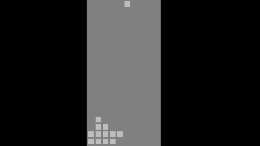
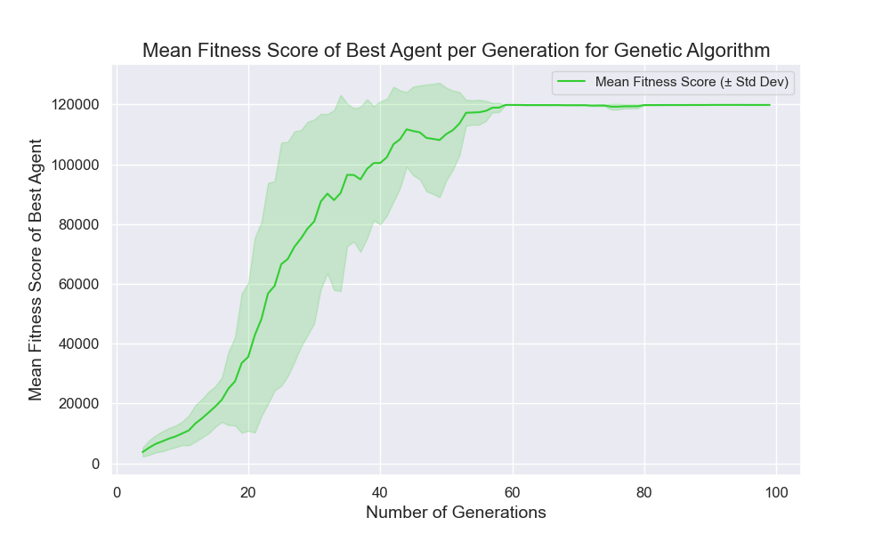
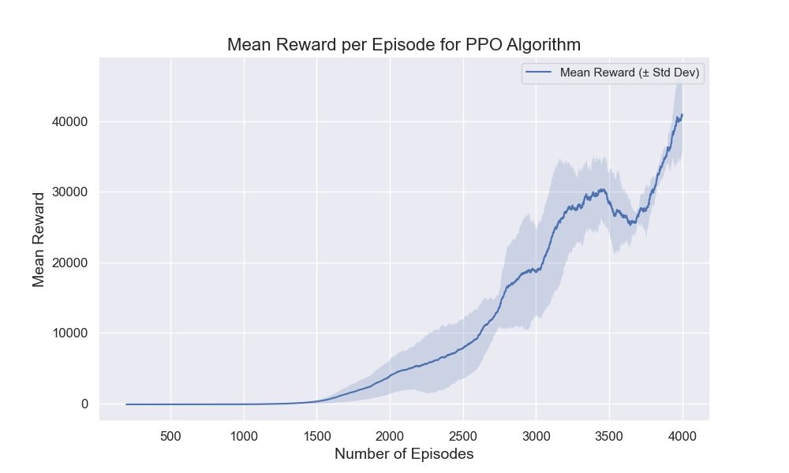
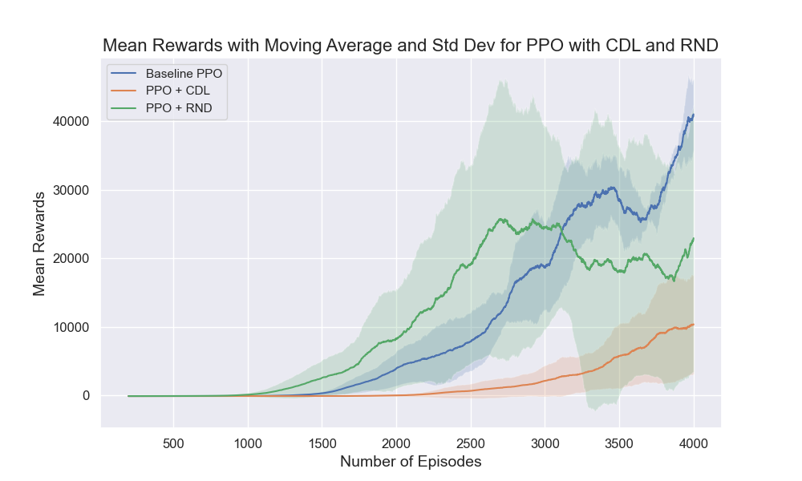

# Tetris-RL-Optimisation




## Overview
This repository presents the differences in performance between a Genetic Algorithm (GA) and the Proximal Policy Optimisation (PPO) algorithm, including variants that integrate exploration-based methods like Curiosity-Driven Learning (CDL) and Random Network Distillation (RND). Additionally, it examines how different weight initialisation strategies impact the learning and performance of these algorithms in the context of the game Tetris.


## State Representation Using State Features

In this project, Tetris game states are represented using a set of **state features** rather than raw pixel data. State features capture essential characteristics of the game board, which simplifies the learning process for reinforcement learning algorithms by reducing the complexity of the state space. 

A total of **26 state features** are used to represent the Tetris board states, including:

- **Height of each column:** The number of blocks in each column of the board.
- **Bumpiness of each column:** The absolute difference of each adjacent column.
- **Number of holes:** The total number of empty spaces (gaps) beneath the topmost block in any column.
- **Row and column transitions:** The number of horizontal and vertical transitions between empty and filled cells.
- **Landing height, maximum column height, wells, and eroded piece cells:** Metrics that capture advanced game dynamics, such as where a tetromino lands and the resulting clearances.


## PPO modifications
### PPO with CDL
**Curiosity-Driven Learning (CDL)** was integrated with the PPO algorithm to encourage exploration by rewarding the agent for visiting novel states. The intrinsic reward is calculated based on the prediction error between the expected and actual next states. Higher prediction errors indicate unfamiliar states, incentivising the agent to explore and discover more efficient strategies during gameplay. However, results showed that merely adding curiosity-based exploration without considering weight initialisation led to suboptimal performance.


### PPO with RND
**Random Network Distillation (RND)** modifies PPO by incorporating two neural networks: a fixed "target" network and a "predictor" network. The agent receives an intrinsic reward based on the prediction error between these two networks' outputs, which encourages the agent to explore states it hasn't visited often. This approach demonstrated some improvement in learning speed, but performance remained inconsistent across runs, highlighting the impact of initial weight distributions.


### PPO-PI
**PPO with Population Initialisation (PPO-PI)** involves creating an initial population of agents with diverse weight distributions and selecting the best-performing agent to start training. This approach aims to ensure that the PPO algorithm begins training with a more optimal weight configuration, reducing the likelihood of suboptimal performance due to poor initialisation. The method showed a notable improvement in performance and stability compared to the baseline PPO.

### GA-PPO
**Genetic Algorithm-Assisted PPO (GA-PPO)** leverages a Genetic Algorithm (GA) to pre-optimise the weights of the neural network before integrating them into a PPO agent. This strategy aims to provide the PPO with a strong starting point by using evolved weights that have already been refined for better performance. While this method showed an initial boost in learning speed, it faced challenges such as overfitting and catastrophic interference, leading to varied results over time.


## Results
<p align="center">
  
  
  
</p>

## Conclusion
This project shows that optimising the initial weight distribution is crucial for improving the performance of reinforcement learning algorithms in Tetris, more so than merely integrating exploration-based methods. Further research could explore more advanced weight initialisation techniques and their application across different environments.


## Installation
1. Clone the repository:
   ```sh
   git clone https://github.com/yourusername/Tetris-RL-Optimisation.git
   ```
2. Install the dependencies:
   `pip install -r requirements.txt`
   
3. Install the custom Tetris environment:
   ```sh
   cd environment/gym-simpletetris
   pip install -e .
   ```

## Usage
To run experiments, use the provided scripts. For example, to train a PPO agent integrated with curiosity-driven learning (CDL):
`python run_ppo_cdl.py`


